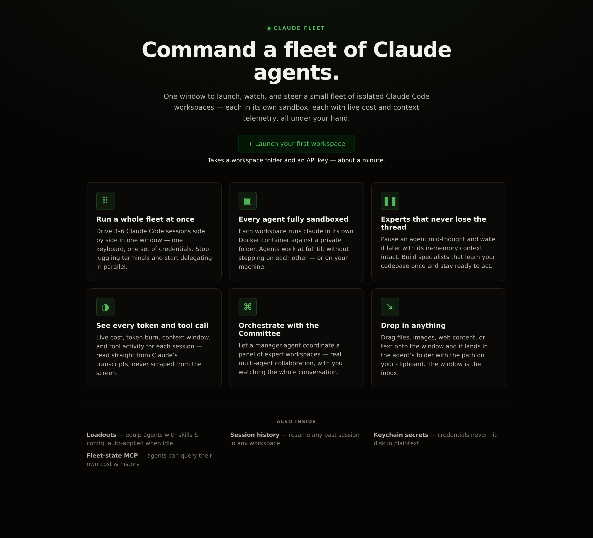
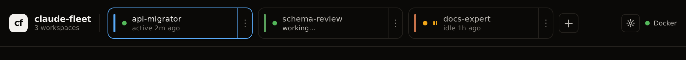
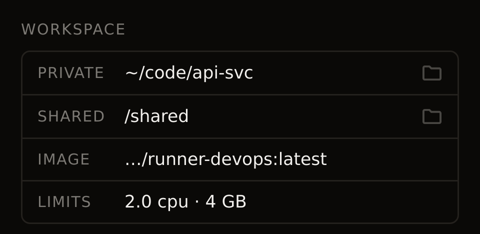
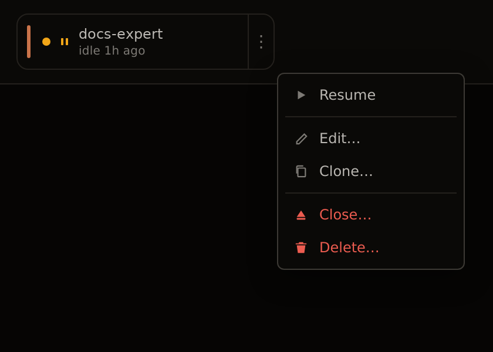
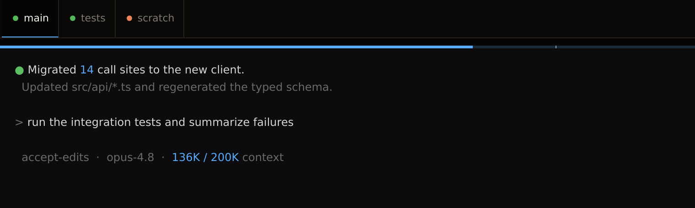
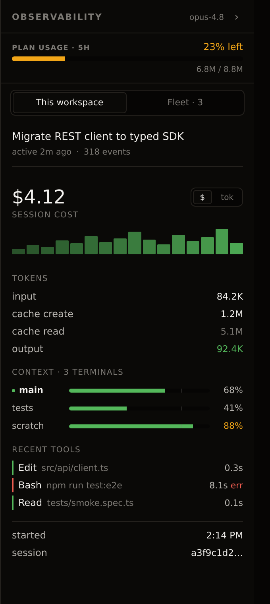
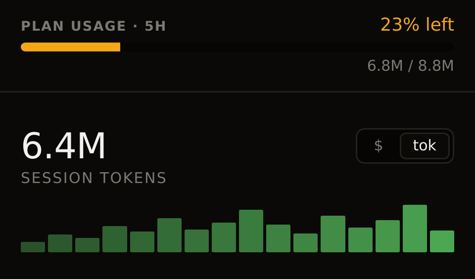
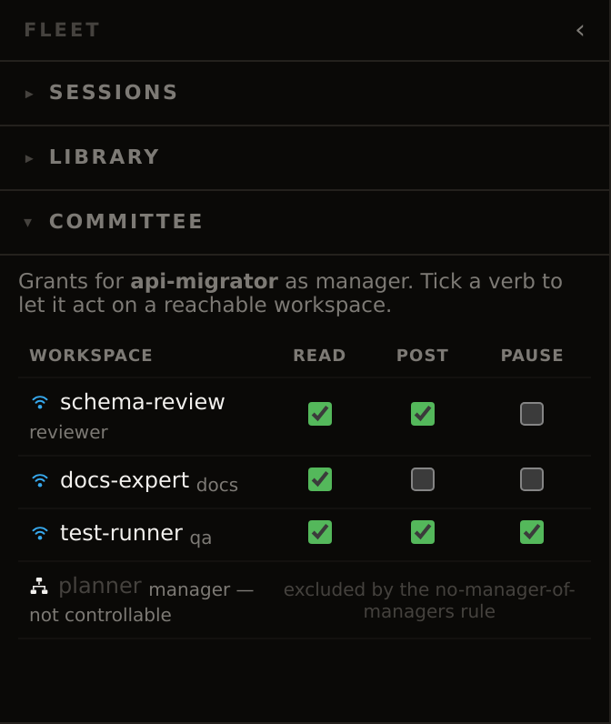
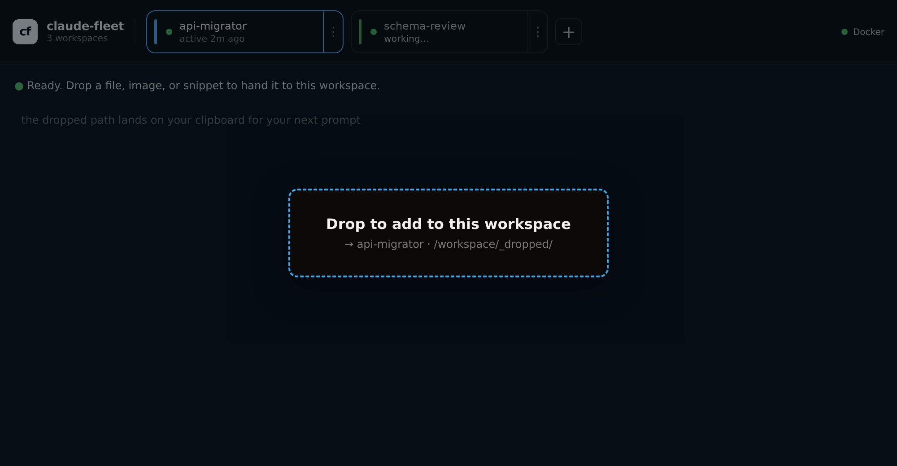

<div align="center">

# 🚢 claude-fleet

### Command a fleet of Claude agents — from one window.

[](https://github.com/ImIOImI/claude-fleet/releases/latest)
[-black?style=for-the-badge&logo=apple&logoColor=white)](https://github.com/ImIOImI/claude-fleet/releases/latest)
[](https://github.com/ImIOImI/claude-fleet/releases/latest)
[](https://github.com/ImIOImI/claude-fleet/releases/latest)

<sub>Builds are unsigned — macOS Gatekeeper and Windows SmartScreen will warn on first launch.</sub>

Launch, watch, and steer a small fleet of **isolated Claude Code workspaces** side by side. Each runs in its own sandbox, each with live cost and context telemetry, all under your hand — so you can stop juggling terminals and start delegating in parallel.



</div>

---

## Why claude-fleet?

Running one Claude Code session is great. Running **three to six at once** — each on its own task, in its own sandbox, without losing track of what any of them is doing or spending — is a different problem. claude-fleet is the operator console for exactly that.

It's a **local-only desktop app**: everything runs on your machine, against your local Docker daemon, with your credentials in your OS keychain. No remote orchestrator, no cloud, no telemetry.

## What makes it special

### 🚀 Run a whole fleet at once
Drive 3–6 Claude Code sessions in a single window — one keyboard, one set of credentials. The top strip is your fleet at a glance: each chip shows its workspace's live state and what it's doing right now.



> **Value:** delegate several tasks in parallel and supervise them all from one place — `api-migrator` is active, `schema-review` is mid-turn ("working…"), `docs-expert` is paused — instead of fanning out across a dozen terminal windows.

### 🛡️ Every agent fully sandboxed
Each workspace runs `claude` in its **own Docker container** against a private host folder (plus a shared fleet folder when you want collaboration), on the image you choose, under CPU/memory caps you set. Agents only ever see what you bind-mount in.



> **Value:** let agents run at full tilt — edit files, run commands, install things — without stepping on each other or on your machine.

### 🧠 Expert workspaces that never lose the thread
A small in-container **broker** owns every `claude` PTY, so processes outlive any disconnect. **Pause** a whole workspace and its session set, quit the app, come back tomorrow, **Resume** — and re-attach to every session with its in-memory context (analyses, file watches, MCP state) intact.



> **Value:** build domain specialists that learn your architecture/docs/codebase once, sleep when idle, and wake up ready to act — no re-priming the context every time.

### 🎯 Watch the context window fill in real time
A slim **context rail** sits at the top of every terminal — the workspace's hue, filled left-to-right with the latest turn's share of the model's context window, with a tick at the 80% mark where Claude auto-compacts.



> **Value:** see at a glance how much room a session has left and get a heads-up *before* a surprise compaction drops detail mid-task — no guessing, no `/context` spam.

### 📊 See every token and tool call
A live observability rail reads straight from Claude's own transcript JSONL — never scraped from the screen. Per-session **cost, a per-turn cost/token sparkline, the full token breakdown, per-terminal context bars, and recent tool calls** (with errors flagged).



> **Value:** know exactly what each agent is doing and what it's costing in real time — and spot the `npm run test:e2e` that just failed without scrolling the terminal.

### 📈 Stay inside your plan's rolling token budget
At the top of that rail, a fleet-wide **plan-usage gauge** tracks tokens spent across *all* workspaces in the current rolling window (default 5h) — a depleting bar that tints amber, then red, as you approach the ceiling. Just below, the session graph's headline flips between **session cost** and **session tokens** with a per-turn sparkline either way.



> **Value:** one honest number for "how close am I to my plan limit right now," summed across the whole fleet — so a runaway agent can't quietly burn your window out from under the others.

### 🤝 Orchestrate with the Committee
A per-workspace **permissions matrix** decides who can do what: pick a **manager** workspace and tick `read` / `post` / `pause` for each reachable **expert**. The grant is the whole security model — a manager can only ever act on a workspace that opted in (and never on another manager).



> **Value:** compose specialists into a team (architect + reviewer + implementer) with explicit, least-privilege grants — multi-agent collaboration you can see and control, not a black box.

### 📥 Drop in anything
Drag OS files, pasted images, web content, or text fragments onto the window and they land in the selected workspace's folder — with the path on your clipboard for your next prompt.



> **Value:** the window is the agent's inbox; feeding it a screenshot, a log, or a spec is a single drag.

### And more under the hood
- **Loadouts** — installable skill/config packs, auto-applied to a workspace when the agent goes idle. Equip an agent with tools and knowledge in one click.
- **Session history & resume** — a global, workspace-filterable table of past sessions with auto-generated titles. Resume **any** session in **any** workspace; the record survives workspace deletion.
- **Keychain-backed secrets** — credentials live in the OS keychain via Electron `safeStorage` and are injected as env vars by the main process. They never touch the renderer or hit disk in plaintext.
- **Fleet-state MCP** — agents can query their own cost, sessions, prompts, and events through a read-only MCP server (typed tools + a raw read-only SQL escape hatch).

---

## Getting started

**Prerequisites:** Node 20+ and a reachable Docker daemon (Docker Desktop with WSL2 integration, or native `dockerd`).

```bash
npm install
npm run dev
```

On first run the window greets you with the screen above — hit **Launch your first workspace**, point it at a folder, pick OAuth (Claude.ai Pro/Max) or an API key, and you're off. See [Authenticating `claude` inside a workspace](#authenticating-claude-inside-a-workspace) for the auth modes.

> **Just want to poke at the UI?** Mock mode needs no Docker, image, or API credit:
> ```bash
> CLAUDE_FLEET_MOCK=1 npm run dev
> ```

## Docs

- [`docs/SPEC.md`](docs/SPEC.md) — product spec. Single source of truth for what claude-fleet is, how it's built, and which decisions are pending. Start here if you're contributing.
- [`docs/design/`](docs/design/) — per-surface design docs with screenshots (e.g. the [first-run landing](docs/design/first-run.md) and the [workspace modal](docs/design/workspace-modal.md)).
- [`design/README.md`](design/README.md) — hi-fi visual reference. Canonical design tokens (`design/tokens.css`) and unpacked artboards (`design/components/*.jsx`); refer to these when implementing UI.

## Stack

- Electron + Vite + React + TypeScript (via `electron-vite`)
- `dockerode` for the Docker daemon
- `@xterm/xterm` for terminal panes
- Electron `safeStorage` for the credentials vault (OS keychain)
- `better-sqlite3` for local history/cost storage

## Develop

```bash
npm install
npm run dev
```

### Running dev on WSL

The vault uses Electron `safeStorage`, which wants a Secret Service implementation (gnome-keyring, KeePassXC) on Linux. Bare WSL doesn't ship one, so the app opts into `safeStorage`'s plaintext backend and falls back to reading `ANTHROPIC_API_KEY` from the environment — enough for daily dev work:

```bash
ANTHROPIC_API_KEY=sk-... npm run dev
```

A header banner shows when the fallback is active. To exercise the vault end-to-end (named secrets, encrypted writes), install and start a keyring:

```bash
sudo apt install gnome-keyring libsecret-1-0
eval "$(gnome-keyring-daemon --start --components=secrets)"
export DBUS_SESSION_BUS_ADDRESS  # set by the daemon
npm run dev
```

This only matters for development on WSL. The packaged Windows build uses Credential Manager (DPAPI) — no setup required.

### Mock mode (no Docker, no API key)

Iterate on the UI without a Docker daemon, runner image, or API credit:

```bash
CLAUDE_FLEET_MOCK=1 npm run dev
```

The top strip pre-populates with two fake workspaces; `+ New workspace` adds more to an in-memory store. Selecting a workspace attaches a tiny mock shell that echoes input and responds to `help`, `clear`, `whoami`, and `echo`. A `MOCK MODE` chip in the header makes the state obvious. Restart `npm run dev` to reset the fake fleet.

Mock mode is dev-only — the env var is ignored by the packaged build.

### Quiet the WSLg GPU error

On WSLg, Chromium's GPU process fails to initialize (`viz_main_impl.cc(166) ERROR: Exiting GPU process due to errors during initialization`). It's harmless — rendering falls back to CPU — but it clutters the dev terminal every session and buries real errors.

Turn on **Settings (gear icon) → Disable hardware acceleration** and restart the app. For a one-off dev run, the `CLAUDE_FLEET_DISABLE_HWA=1` env var forces it on without touching the setting:

```bash
CLAUDE_FLEET_DISABLE_HWA=1 npm run dev
```

## Test

```bash
npm test          # build then run the Playwright smoke suite
npm run test:e2e  # run tests against the existing build (no rebuild)
```

The smoke suite (`tests/smoke.spec.ts`) covers regressions we've hit before: preload loading, `+ New workspace` opening the modal, validation surfacing inline, OAuth-mode submission, missing-workspace confirm flow, past-workspaces restart, and the mock-mode UI. Tests need a display (WSLg, X server, or Xvfb in CI).

### Authenticating `claude` inside a workspace

Two modes, picked at workspace-create time:

- **OAuth (Claude.ai Pro/Max)**: the default — no API key is injected. The first time `claude` runs in the terminal it prints a login code; you complete the flow in your browser, and the resulting credentials are saved to a shared, bind-mounted `.credentials.json` so they persist across restarts and every subsequent OAuth workspace skips the browser dance.
- **API key (Console billing)**: supply `ANTHROPIC_API_KEY` as a per-workspace secret (stored in the OS keychain) or, if the keychain isn't usable, via the `ANTHROPIC_API_KEY` env var as a dev fallback. The key is injected into the workspace container.

For the dev fallback to work, launch with the env var set:

```bash
ANTHROPIC_API_KEY=sk-... npm run dev
```

The env fallback is a dev shortcut; production builds should not rely on it.

## Runner image

The app uses `ghcr.io/imioimi/claude-fleet/runner:latest` (published by `.github/workflows/publish-runner.yml`) and pulls it automatically when creating a workspace. To pull manually:

```bash
docker pull ghcr.io/imioimi/claude-fleet/runner:latest
```

Or build from source (useful when iterating on `docker/Dockerfile`):

```bash
docker build -t ghcr.io/imioimi/claude-fleet/runner:latest docker/
```

## Release

Releases are cut from `main` via a version-bump PR followed by a tag push. The tag build (`.github/workflows/build-app.yml`) compiles unsigned installers for macOS (`.dmg`), Windows (`.exe`), and Linux (`.AppImage`) on native runners and attaches them to a **draft** GitHub Release.

1. **Make sure everything shipping is merged** and CI on `main` is green. Pick the version per semver: minor for features, patch for fixes.

2. **Open a release PR** that bumps only the version:

   ```bash
   git checkout -b release-vX.Y.Z
   npm version X.Y.Z --no-git-tag-version   # updates package.json + package-lock.json
   git commit -am "chore: release vX.Y.Z"
   git push -u origin release-vX.Y.Z
   gh pr create --title "chore: release vX.Y.Z" --body "<one-line headline of what ships>"
   ```

   The bump touches `package.json`/`package-lock.json`, so the full build matrix runs on the PR.

3. **Squash-merge once green**, then tag the squash commit on `main`:

   ```bash
   git checkout main && git pull
   git tag vX.Y.Z && git push origin vX.Y.Z
   ```

4. **Wait for the tag build** to draft the GitHub Release with installers attached (`gh run watch`), then review the draft — sanity-check the artifacts, write the release notes — and publish it:

   ```bash
   gh release edit vX.Y.Z --draft=false
   ```

The binaries are unsigned (see the Windows-installer notes in `docs/SPEC.md` §4), so expect OS trust prompts on first launch.
