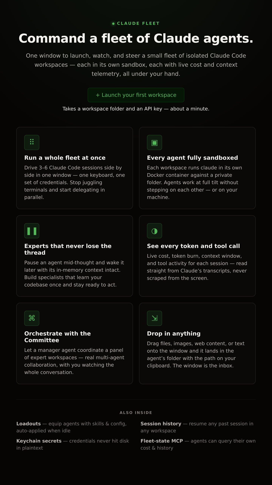

# First-run landing — design

This document captures the **first-run state** of the main pane (`App.FirstRun`, rendered whenever the live fleet is empty). It is deliberately an *advertisement* for the product rather than a bare "no workspaces yet" empty state: a new user opens claude-fleet to nothing, so the main pane uses that moment to pitch what the fleet does and the value each capability buys before asking them to create their first workspace.

Screenshots live in [`assets/design/first-run/`](../../assets/design/first-run/).

## Goals

- **Sell, don't just explain.** Lead with the headline promise ("command a fleet of Claude agents"), then name each distinctive capability and the value it delivers — not a feature checklist.
- **One obvious next step.** A single primary CTA (*Launch your first workspace*) with a low-friction hint ("a workspace folder and an API key — about a minute").
- **On-brand and at home in the app.** Reuses the existing dark token system and the prominent claude-fleet green (`--ok`); no separate marketing skin to maintain.
- **Responsive.** The feature grid and footer reflow from three columns to two to one as the window narrows — the app is resizable and the pitch has to hold up at any width.

## Layout

Three stacked sections inside `.landing` (pinned `absolute; inset:0` within the `position:relative` `.main-body`, scrolls internally):

1. **Hero** — green `claude fleet` eyebrow with a glowing dot, a large gradient headline, a one-paragraph lede, the primary CTA button, and the friction-reducing hint.
2. **Feature grid** (`.landing-features`, `auto-fit minmax(260px, 1fr)`) — six cards, each an accent-tinted glyph + title + a value-oriented blurb:
   | Glyph | Feature | The value it sells |
   |-------|---------|--------------------|
   | ⠿ | Run a whole fleet at once | 3–6 parallel Claude Code sessions, one window/keyboard/credential set |
   | ▣ | Every agent fully sandboxed | per-workspace Docker isolation against a private folder |
   | ❚❚ | Experts that never lose the thread | pause/resume with in-memory context intact (expert workspaces) |
   | ◑ | See every token and tool call | live cost / token / context / tool observability from transcripts |
   | ⌘ | Orchestrate with the Committee | cross-workspace multi-agent collaboration |
   | ⇲ | Drop in anything | drag-and-drop file/image/text ingestion into the agent's folder |
3. **Footer strip** (`.landing-more`) — an `also inside` eyebrow over a compact grid name-dropping the secondary features: **Loadouts**, **Session history**, **Keychain secrets**, **Fleet-state MCP**.

## States

### 1. Desktop — full landing (3-column grid)

The default at a typical window width: hero centered at ~720px max, feature cards in three columns at ~920px max, footer strip below the rule. The soft green radial wash at the top of the canvas echoes the fleet accent.

### 2. Narrow window — responsive reflow (2-column grid)

As the window narrows, the feature grid collapses to two columns (then one) and the footer strip to two, with the hero headline wrapping. Card hover lifts (`translateY(-2px)` + border brighten + shadow) are not visible in a static capture but are present.

## Styling notes

- All styling lives under `.landing*` / `.feature-card` in [`src/renderer/src/styles.css`](../../src/renderer/src/styles.css), built entirely from existing design tokens (`--ink*`, `--bg*`, `--rule*`, `--ok`, `--r-*`, `--shadow`).
- The component is presentational only (`App.FirstRun`, props: `onNewWorkspace`); the feature list is a static `FLEET_FEATURES` array in `App.tsx`, easy to extend.
- The CTA routes through the same `onNewWorkspace` handler as the top strip's *Add workspace* button — there is one create flow, this just gives the empty state a louder front door.

## Reproducing the screenshots

The screenshots were cut from a self-contained harness (`/tmp/landing-harness.html`) that links the real `styles.css` and reproduces the `FirstRun` markup, rendered headless at `--force-device-scale-factor=2` (2× for crisp captures): the desktop shot at a 1300-wide window, the responsive shot at 720-wide. Regenerate by running the app (`npm run dev`) with no workspaces, or by re-rendering the harness against the current `styles.css`.
