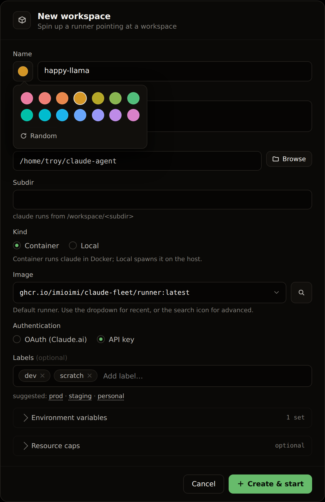
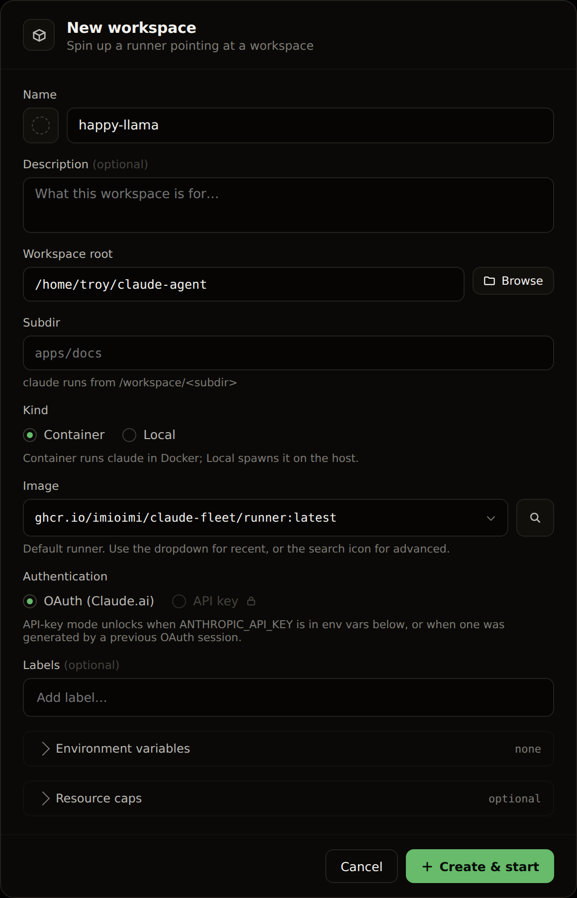
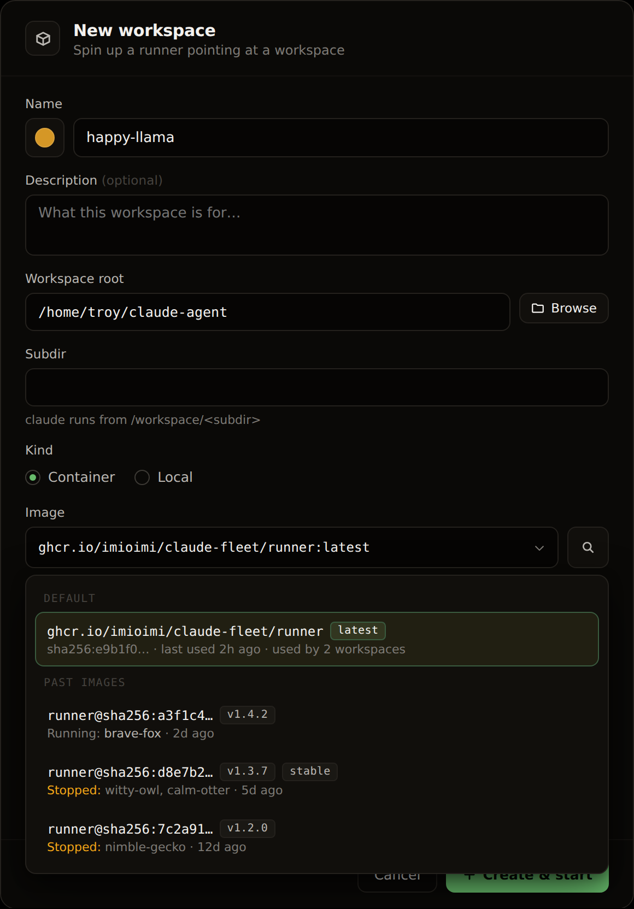
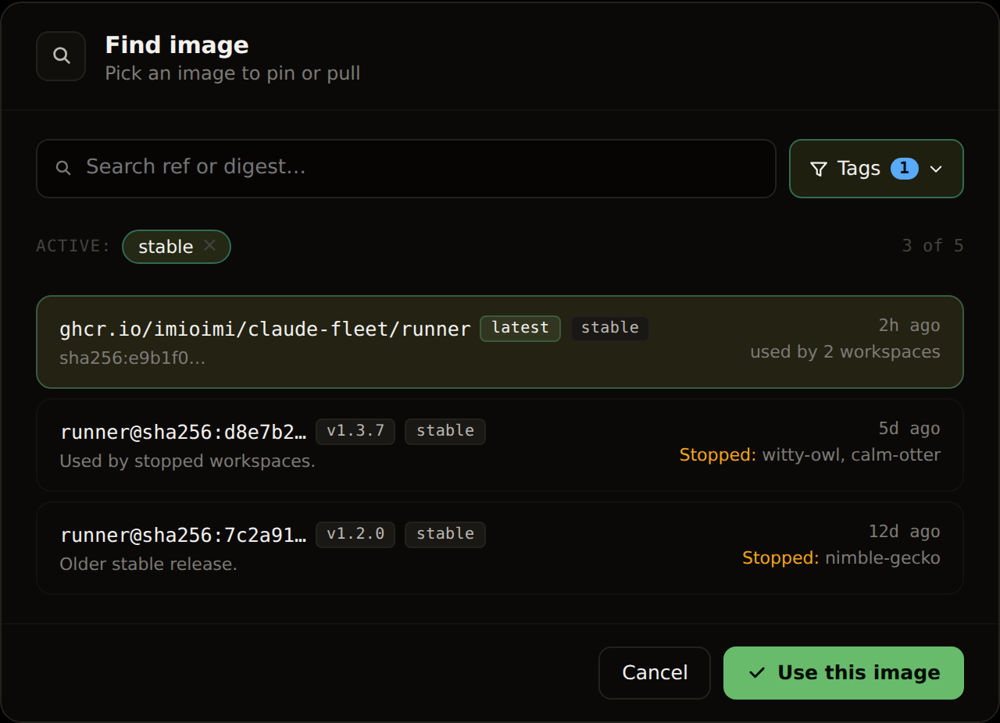
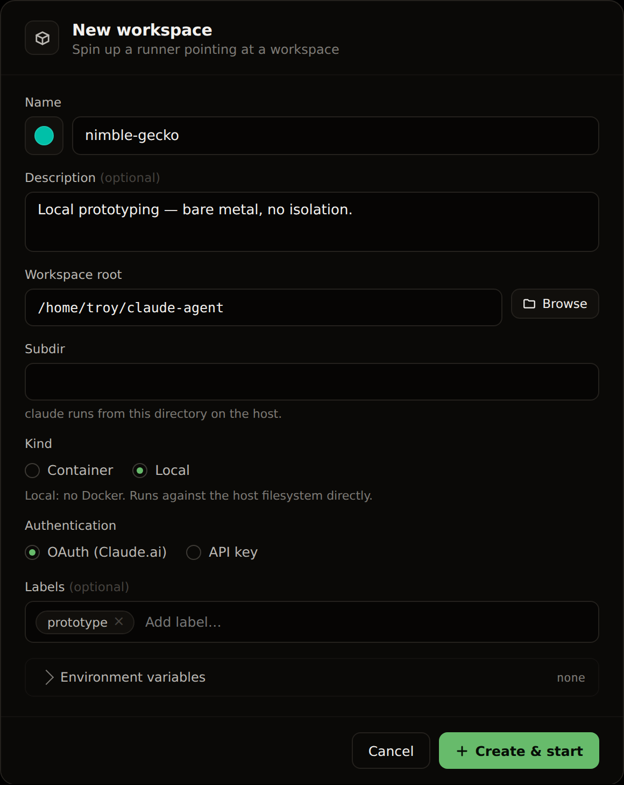
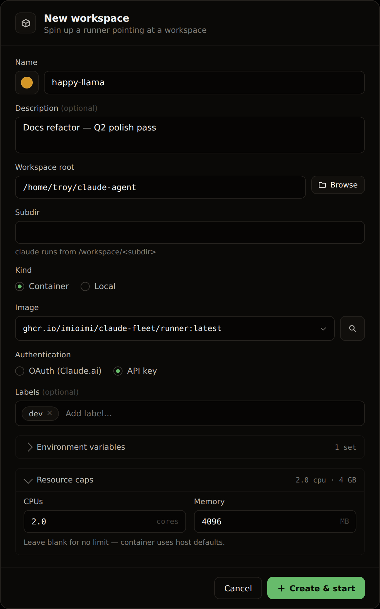
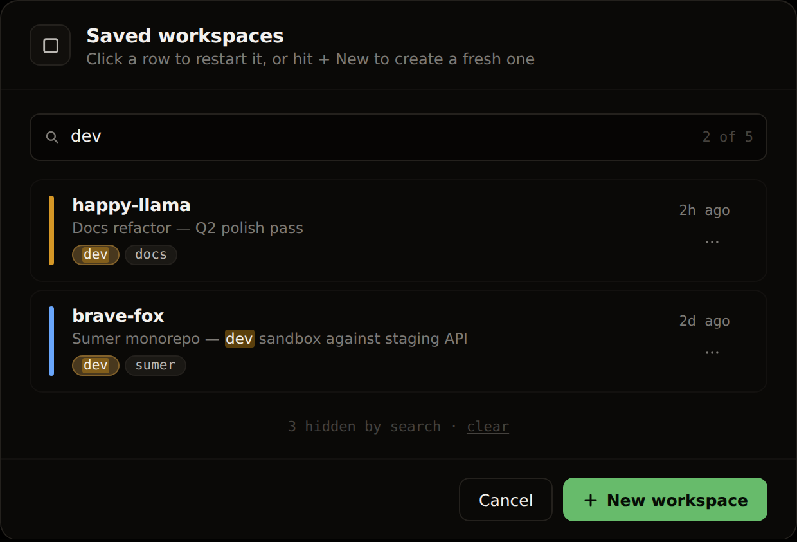
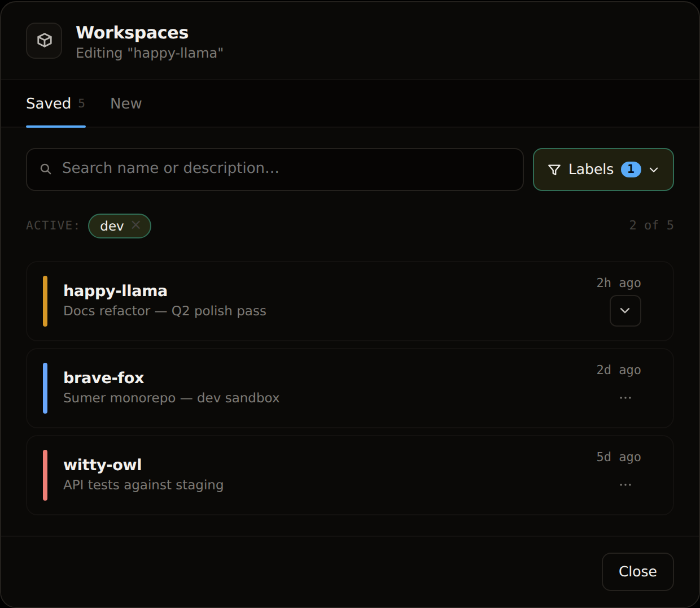
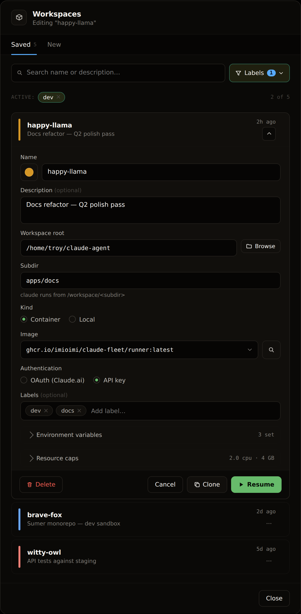

# Workspace modal — design

> **Status**: implemented in `src/` (the modal shipped across #58-era foundation PRs; the Model picker landed with #256). This doc is the visual reference for the modal's states; keep it in sync when the form changes.

This document describes the workspace modal — the single UI surface for creating new workspaces, restarting saved ones, editing config, cloning, and deletion. It replaces `CreateWorkspaceModal.tsx` + `ProfilesDialog.tsx` with a unified flow.

Screenshots live in [`assets/design/workspace-modal/`](../../assets/design/workspace-modal/).

## Goals

- **One surface, full workspace lifecycle**: Create, Resume, Clone, Edit, Delete.
- **Profiles dissolve**: per-workspace env vars (incl. secrets via keytar) replace the global profile concept.
- **Image library is first-class**: easy access to past images, including those used by stopped workspaces.
- **The cold fleet is searchable**: find saved workspaces by name, description, or label.
- **Identity that survives renames**: workspaces keyed by ULID, not by name.

## Big picture

The modal has two tabs in an underlined-tab pattern:

| Tab     | Purpose                                                                 |
|---------|-------------------------------------------------------------------------|
| Saved   | List of stopped workspaces. Search + label filter. Click a row to expand for editing. From the expanded row: **Resume**, **Clone**, or **Delete**. |
| New     | The Create form, blank. Spawns a fresh workspace. |

The Create form is the same React component reused across Create, Clone, and Edit modes — only initial values and footer actions differ.

## States

### 1. Filled · color picker open


The popover opens when the swatch left of the name input is clicked. **14 preset hues in a 7×2 grid + Random**, hues evenly spaced (≈25.7° apart at OKLCH lightness 72%, chroma 0.14) so every chip stays in the same visual family.

### 2. Empty · Model = Claude · OAuth (API-key option disabled)


Default state for a fresh modal. The **Model** combobox sits directly above Auth and defaults to Claude. The **dashed swatch** indicates no color picked yet (a random hue is assigned on Create unless overridden). The **API key** radio is disabled with a lock icon — it becomes available when `ANTHROPIC_API_KEY` is in `env.plain`, exists as a secret for this workspace, or was generated by a previous OAuth-bound session. OAuth alone is sufficient for Create, so the primary button stays enabled.

### 3. Image picker open


Inline dropdown below the Image select. Default tag (`latest`) at top; past images grouped below with Docker tags rendered as chips. Each row notes which workspaces use it (including stopped ones, called out in warning color) plus the digest in the meta line.

### 4. Advanced image search


Opens when the magnifying-glass icon next to the Image select is clicked. Same shape as the Saved-workspaces search: split text input (matches ref + digest) + **Tags** dropdown filter + active filter pills. Each row: ref + tag chips, digest, last-used time, workspaces using it (stopped called out in warning color).

### 5. Local kind


When `kind = local`: Image field disappears (no Docker image), Resource caps disclosure hides (no Docker = no Docker resource limits). `claude` runs directly against the host filesystem from the workspace root + subdir.

### 6. Resource caps open


Two mono inputs in a 2-col grid: `CPUs` (cores) and `Memory` (MB). Units sit inside the input on the right edge. Disclosure summary shows the live values when collapsed (`2.0 cpu · 4 GB`). Blank means no Docker limit; the container uses host defaults.

### 7. Saved workspaces · search across name / description / labels (legacy presentation)


An earlier combo-search shape — a single input matching name + description + labels with substring highlight. Superseded by **state 8** (Variant B split search), kept here as a reference for the simpler shape.

### 8. Saved tab — collapsed list with Variant B label search


The canonical Saved-tab default. Split bar: text input (matches name + description only) + **Labels** dropdown button with a count pill. Selected labels appear as removable pills below the bar. Active filter chip on `dev` filters the list to 2 of 5 workspaces.

### 9. Saved tab — row expanded for editing


Clicking a saved row expands it in place. The full edit form unfolds inline, pre-filled with the workspace's values. Three primary actions sit at the row's footer:

- **Resume** (primary, play icon): applies any edits + starts the container.
- **Clone** (secondary, copy icon): spawns a new workspace using these values as a template — new ULID, fresh color, name auto-suggests `<source>-2` (auto-incrementing if taken).
- **Delete** (danger, trash icon): purges the workspace's state dir + manifest + all its keytar entries.

The chevron in the row header rotates 180° when expanded; clicking it collapses without applying changes.

#### Expansion animation
- CSS `grid-template-rows: 0fr → 1fr` over 320ms `cubic-bezier(0.32, 0.72, 0, 1)`.
- Form contents fade-and-slide in (`opacity 0 → 1`, `transform: translateY(-3px) → 0`) over 220ms with 80ms delay.
- Chevron rotation shares the easing curve.

### 10. Model combobox open


The **Model** row sits directly above Auth. Claude is first and default; each
registry endpoint renders two lines (name, `modelId · baseUrl`) with a badge;
the final "＋ Add endpoint…" entry deep-links to Settings → Model Endpoints.
With an empty registry the list is just Claude + Add endpoint — there is no
locked dead-end state.

### 11. Endpoint selected — Auth morphs


With an endpoint selected there is nothing to choose under Auth: the radios
are replaced by a passive note naming the endpoint's stored key ("key from
endpoint registry (none stored → placeholder token) · edit"). Switching back
to Claude restores the radios with the previous selection intact. A workspace
whose endpoint was deleted shows "(deleted endpoint)" here and blocks submit
until re-picked.

## Data model

### `WorkspaceSpec`
On-disk at `<userData>/state/<id>/workspace.json`:

```ts
type WorkspaceKind = 'container' | 'local';
type AuthMode = 'oauth' | 'apikey';

interface WorkspaceSpec {
  id: string;             // ULID — identity, never changes
  name: string;           // mutable label, unique across fleet
  description?: string;
  labels: string[];       // free-form, used only for filtering the Saved tab
  color?: { hue: number }; // from preset palette; random if unset
  workspaceRoot: string;
  workspaceSubdir: string;
  kind: WorkspaceKind;
  image?: string;         // image ref (only when kind = container)
  authMode: AuthMode;
  env: {
    plain: Record<string, string>;
    secretKeys: string[]; // values stored in keytar, never on disk
  };
  resources?: { cpus?: number; memoryMb?: number };
  createdAt: number;
  lastUsedAt: number;
}
```

### Files under `<userData>/state/<id>/`
| Path                                                  | Purpose                                                                         |
|-------------------------------------------------------|---------------------------------------------------------------------------------|
| `workspace.json`                                      | the manifest above                                                              |
| `.claude/.credentials.json`                           | symlink to `<userData>/claude-shared/.credentials.json` when `authMode=oauth`   |
| `.claude/settings.json`, `.claude/mcp.json`           | per-workspace `claude` config                                                   |
| `.claude/projects/<dir>/<session>.jsonl`              | per-workspace transcripts (observability source)                                |
| `broker.sock`                                         | broker UNIX socket                                                              |

### Vault layout (keytar)
- `service: claude-fleet`
- Secret accounts: `<workspace-id>:<key>` (e.g., `01ARZ3NDEKTSV4RRFFQ69G5FAV:ANTHROPIC_API_KEY`)
- Per-workspace index: `__secrets__:<workspace-id>` → JSON array of secret keys
- Legacy `__profiles__:*` entries get purged in the clean-slate migration.

### Docker container
- Container name: `cf-<id>` (must be unique on the host, but lookup is by label).
- Label: `com.claude-fleet.id` carries the ULID — this is the stable lookup key, surviving rename.
- Env injection at start: `env.plain` merged with secrets resolved via `vault:getSecret(workspaceId, key)`, plus `HOME=/home/fleet`.

## Behavior details

### Authentication mode
**OAuth** is the default. The first OAuth-mode workspace prints the Claude.ai login URL the first time `claude` runs in its terminal; the resulting credentials land in `<userData>/claude-shared/.credentials.json`. Every subsequent OAuth-mode workspace bind-mounts that **same file** into its `.claude/.credentials.json` and skips the browser dance entirely. Token refresh in any workspace updates the shared file in place.

**API key** is only available when there is an API key to use:
- `ANTHROPIC_API_KEY` exists in `env.plain`, OR
- A secret named `ANTHROPIC_API_KEY` exists in the workspace's keytar entries, OR
- A key was stored from a previous OAuth-bound session.

Until then the radio sits greyed out with a lock icon and an inline hint pointing at the env-vars disclosure.

### Color picker
14 preset hues in a 7×2 grid + Random button (popover triggered by the swatch left of the name input). Hues at OKLCH `L 72% / C 0.14`, evenly spaced. Unset → random hue assigned at Create.

### Labels
Free-form string tags edited inline in the modal as a chip input. Autocomplete suggestions are deduped from `labels[]` across all manifests at render time (no global registry to maintain). Visibility: **modal + Saved-tab list/search only** — labels do not render on the chips in the top strip.

### Saved-tab search (Variant B)
- Split bar: text input on the left (matches `name` + `description` only), **Labels** button on the right.
- Labels dropdown: checkbox list of all labels in the fleet, each with a usage count. Multiple selections apply as an **OR** filter ("any match"). Footer of the dropdown shows the selected count + clear-all link.
- Active filters surface as removable pills above the list, plus an `N of M` count on the far right.

### Image picker
Two surfaces with overlapping content:
- **Inline dropdown** (basic): short list of recent images, opens directly below the Image select. Click an entry to pick.
- **Advanced search** (magnifying-glass icon next to the select): full modal mirroring the Saved-workspaces shape. Text search across ref + digest; **Tags** dropdown for filtering. Each row exposes which workspaces (including stopped ones) used the image — useful when the user wants to pin a specific known-good build.

### Resume / Clone / Delete
From an expanded Saved-tab row:
- **Resume**: validate edits → write manifest → start the container → close modal.
- **Clone**: validate → create a new workspace with current values (new ULID, fresh color, suggested name `<source>-2`, auto-incrementing if taken). Source workspace is unchanged.
- **Delete**: confirm modal — *"Permanently delete `<name>`? This removes the workspace and all stored credentials. This cannot be undone."* → on confirm, purge state dir + manifest + all keytar entries for that ULID.

### Restart-to-apply (running workspaces, chip ⋮ menu Edit)
When the user edits a *running* workspace from the chip ⋮ menu (a separate path from the Saved tab; the Saved tab's workspaces are by definition stopped) and changes any container-level field (`env`, `image`, `authMode`, `resources`), saving shows a dismissable banner at the top of the workspace's terminal pane:

> Changes apply on next start. **[Restart now]** [Dismiss]

Banner persists until dismissed or restart fires. Render-only fields (`name`, `description`, `labels`, `color`) take effect immediately and do not surface the banner.

## Migration

Clean slate — zero users today. On first boot post-migration:

1. For each existing manifest:
   - Generate a new ULID.
   - Rename the state dir: `<userData>/state/<name>/` → `<userData>/state/<id>/`.
   - Rewrite the manifest: drop `profile`, set `id`, set `authMode='oauth'`, set `env={plain:{}, secretKeys:[]}`.
2. Purge every keytar entry under `service=claude-fleet` whose `account` is not in the new `<workspace-id>:<key>` or `__secrets__:<workspace-id>` form. This deletes `__profiles__:*` entirely.
3. User re-enters env vars per workspace via the Saved-tab Edit flow on next launch.

## Out of scope (for this modal redesign)

- **Shared secret library across workspaces** — explicitly rejected during design review.
- **Multiple Claude.ai accounts / per-workspace OAuth isolation** — deferred until anyone actually needs it.
- **Rich text in description** — plain textarea only.
- **Renaming Docker container names** — containers get destroyed/recreated on rename via the manifest's new identity; we don't try to mutate live containers in place.

## Related issues

- **#27** — Per-workspace env vars + KV editor → base scope of Foundation PR
- **#22** — Resource caps in modal → folded into Foundation
- **#20** — Chip redesign → consumes the `color` field
- **#10** — Durable transcript mirror → adjacent (transcript path env-var override lives here)
- **#8** — keytar / safeStorage on WSL → orthogonal
- **#7** — Profile rotation → closed by this work

## Ship plan

Three PRs.

| PR | Scope | Closes |
|----|-------|--------|
| 1. Foundation | id refactor (ULID + state-dir rename + container lookup by label) + `WorkspaceSpec` schema additions + vault rewrite to per-workspace keying + Create modal with all new fields + clean-slate migration | #27, #22 |
| 2. Actions    | Edit modal (mode-aware reuse of Create form) + Clone action + Delete action + chip ⋮ menu additions + restart-to-apply banner + Saved-workspaces list rename + per-row search/Edit/Delete + Saved/New tabs | — |
| 3. Shared OAuth | Bind-mount `<userData>/claude-shared/.credentials.json` into each OAuth workspace; first-login populates, subsequent skip browser flow | — |

PR 2 depends on PR 1. PR 3 is independent of both.

## Component sketch

The modal renders as a single React component:

```ts
interface WorkspaceModalProps {
  mode: 'create' | 'edit' | 'clone';
  initial?: WorkspaceSpec; // pre-fill (clone copies; edit reads self)
  onCreate?: (spec: WorkspaceSpec) => Promise<void>;
  onSave?:   (spec: WorkspaceSpec) => Promise<void>; // edit only
  onResume?: (spec: WorkspaceSpec) => Promise<void>; // edit only (Saved-tab inline)
  onDelete?: (id: string) => Promise<void>;
  onClose:   () => void;
}
```

Footer actions by mode:
| Mode   | Footer (left → right)                                |
|--------|------------------------------------------------------|
| create | Cancel · **Create & start** (primary)                |
| clone  | Cancel · **Create & start** (primary)                |
| edit   | Delete · — · Cancel · Clone · **Resume** (primary)   |

The Saved-tab's inline-expanded edit form is the same component rendered with `mode: 'edit'` inside the row's expansion container.
