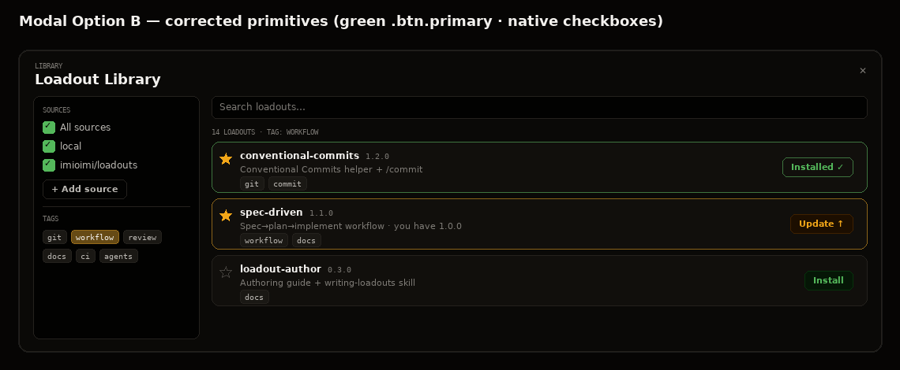
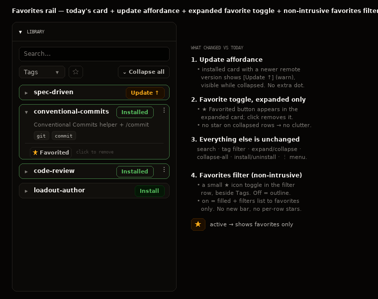
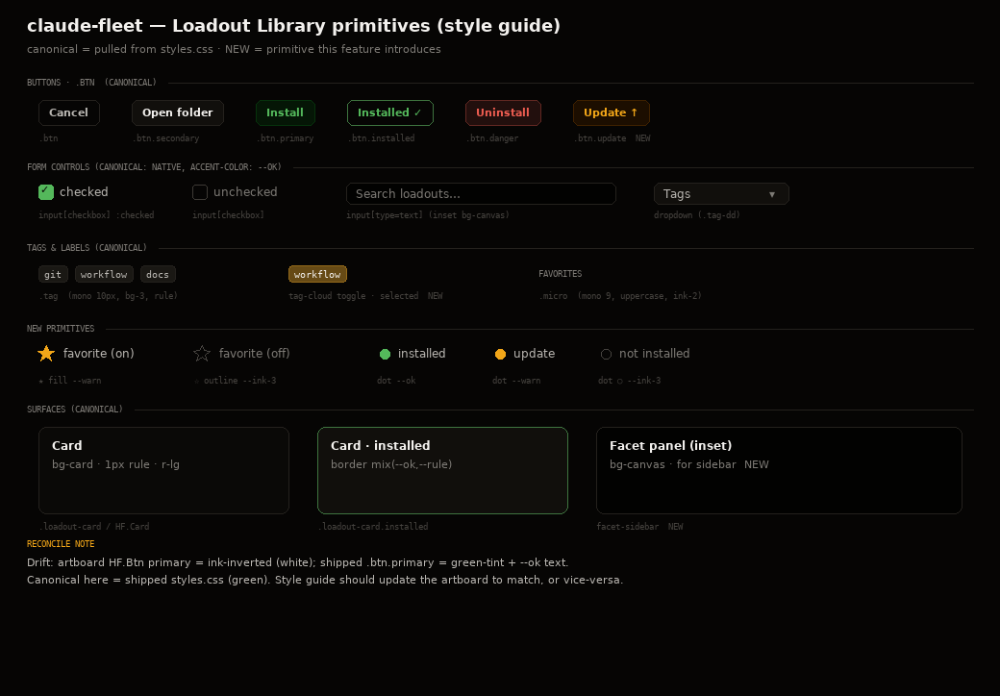

# Loadout Library v2 — remote OCI sources, browser modal, favorites — design

Evolves the loadout library (SPEC §7) along two user-requested axes that turned
out to share one model:

1. **Remote OCI sources** — add public GHCR repos to the library and download
   loadouts from them.
2. **Favorites** — mark loadouts you use a lot and find them quickly in the
   left-rail Library.

Authored loadouts and today's install/uninstall are unchanged; this adds
*fetch + discovery + curation* on top.

## Decisions (locked with the user)

| Area | Decision |
|---|---|
| OCI transport | **Native, zero-dependency client** in the main process (`fetch` against GHCR's `/v2` API). No bundled/host `oras`. |
| Registry scope | **Public GHCR only** in v1, anonymous token flow, **no stored credentials**. Private/org GHCR (PAT in vault) is a follow-up. |
| Discovery | **Index artifact** published by the source (`<source>/index:latest`). Registry-agnostic, anonymous-pullable, avoids GitHub's PAT-gated packages API. |
| Download model | **No "Download" state.** Install pulls transparently + caches; update = re-pull. |
| Update awareness | **Passive**: compare index version vs the downloaded/installed version → surface `Update ↑`. |
| Favorites scope | **Global** (one set, every workspace's rail); state shown per selected workspace. |
| Rail | **Unchanged** from today + 3 minimal additions (below). No favorites-only redesign, **no per-row stars**. |
| Browser modal | **Facet-sidebar layout** (sources checkboxes + tag cloud + search). |

## Architecture

Three units; the existing install/uninstall path is reused untouched.

### 1. `ociCore.ts` — pure core (implemented + unit-tested in this change)
No electron / network / fs. Mirrors how `loadoutCore.ts` is a pure engine.
- `parseImageRef` / `loadoutRefFromSource` — parse + build GHCR refs (rejects non-GHCR in v1).
- `safeLayerPath(destDir, title)` — **security-critical**: confine each artifact layer to the loadout folder; reject `..` / absolute titles.
- `parseIndex` — validate + normalize the index artifact's `index.json`.
- `compareVersions` / `isUpdateAvailable` — passive update detection.
- `assembleCatalog` — merge local library + per-source remote indexes into one deduped, state-stamped catalog (present / installed / updateAvailable / favorited / sources).

### 2. `ociClient.ts` — networked pull (to build)
- Anonymous bearer via 401 → `Www-Authenticate` → `GET ghcr.io/token?scope=repository:<repo>:pull` → retry.
- `fetchAnnotations(ref)` (cheap metadata) and `pullArtifact(ref, destDir)` — fetch manifest, pull each blob by digest, write each to its `org.opencontainers.image.title` path **through `safeLayerPath`**, with a per-blob size cap.

### 3. `loadoutSources.ts` — sources, provenance, favorites (to build)
- Persists `<userData>/loadouts/sources.json`: `{ sources: string[], provenance: { [id]: {source, version, downloadedAt} } }`. `listLoadouts` already filters to directories, so it's ignored.
- `addSource` (validate by pulling + parsing the index, then persist), `removeSource`, `browseSource`/`refreshSources` (cached index).
- `download(ref,id,version)` → `ociClient.pullArtifact` into `<userData>/loadouts/<id>/` + record provenance. **Install** pulls-if-absent-or-stale then runs the existing `installLoadout`; collision with a locally-authored id → **confirm-before-overwrite**.
- Favorites persist in `config.json` (global).

### Index artifact (cross-repo contract)
Published by `claude-fleet-loadouts` at `<source>/index:latest`,
artifactType `application/vnd.claude-fleet.loadout-index.v1`, one `index.json`
layer = `[{id,title,description,tags,version}]`. **This is a paired change**:
the loadouts repo's `publish-loadouts.yml` must emit it and its README/skills
must document it, landing with the consumer implementation (workspace CLAUDE.md
cross-repo rule). Recorded in SPEC §11 Open decisions until then.

### IPC (new, privileged main process)
`loadouts:catalog(workspaceId?)`, `loadouts:listSources` / `addSource` /
`removeSource` / `refreshSources`, `loadouts:download(ref,id,version)`,
`loadouts:setFavorite(id,on)`; `loadouts:install` revised to pull-if-needed.
The MCP server stays read-only (§7 invariant).

### Security (§9 preserved)
Downloads land only in host-private `<userData>/loadouts/` — never bind-mounted
into a container. Only new exposure is outbound main→`ghcr.io`. `safeLayerPath`
+ `parseIndex` defend against hostile artifacts.

## UI

### Browser modal — facet-sidebar layout

Left facet column (source checkboxes + "+ Add source" + clickable tag cloud) and
a search box over a results list. Per-row: title + version, description, mono
tags, and one action — `Install` (`.btn.primary`, green), `Installed ✓`
(`.btn.installed`, green outline), or `Update ↑` (new `.btn.update`, warn).
Native green checkboxes (`accent-color: --ok`).

### Left rail — unchanged + 3 minimal additions

Today's Library is preserved entirely (search, tag filter, per-card
expand/collapse, collapse-all, install/uninstall, ⋮ menu). Additions:
1. **Update affordance** — an installed card with a newer remote version shows
   `Update ↑` (no extra dot).
2. **Favorite toggle, expanded-only** — `★ Favorited` (click to remove) in the
   expanded card body; **no star on collapsed rows**.
3. **Non-intrusive favorites filter** — a small ★ icon toggle beside the `Tags`
   dropdown; on = filled + filters the list to favorites only.

### Style guide

Primitives catalogued against `styles.css`. **New primitives:** `.btn.update`
(`--warn` analog of `.btn.primary`), the facet checkbox-list / inset panel, the
favorite ★ + favorites filter. **Reconcile:** the design artboard's primary
button is ink-inverted while shipped `.btn.primary` is green-tint — **shipped is
canonical**; the artboard should be updated to match when the style guide is
formalized into `styles.css` + `design/`.

## Phasing
- **Phase 1** — modal browser + favorites + rail additions + install-pull
  semantics against the **local** library (no network).
- **Phase 2** — remote OCI sources (`ociClient` + index + update detection) +
  the paired loadouts-repo index publish.

The bundle/UX is identical across phases; only the source of loadouts grows.

## Testing
- `ociCore.test.ts` (this change): real tests for ref parsing, `safeLayerPath`
  (incl. traversal rejection), index parse/validate, version compare, catalog
  assembly; `it.todo` specs enumerate the `ociClient` + `loadoutSources`
  behaviors to build.
- To come with each phase: `ociClient` against a mocked GHCR (token flow, pull,
  traversal abort, size cap); `loadoutSources` (add/remove/browse/download,
  provenance, collision-confirm, favorites, the §9 no-bind-mount invariant); a
  renderer test for the favorites filter; one live integration pull against the
  real public repo.

## Scope guard (YAGNI)
Out of v1: private/org registries + credentials, background update polling,
auto-update, publishing *from* the app, non-GHCR registries.
